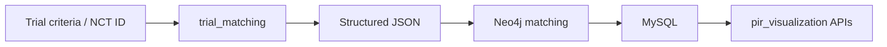
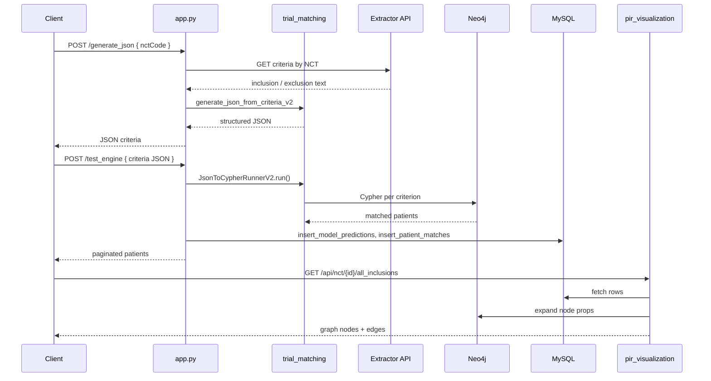

# Graph Trial Match — Technical Documentation

Clinical trial patient-matching backend. Takes trial eligibility criteria (inclusion/exclusion), finds which patients in a medical graph qualify, stores results, and exposes APIs for PIR (Patient Inclusion Results) visualization.

**Pipeline:** Trial criteria → structured rules → patient matching → results + graphs

---

## What This App Contains

| Package | Former name | Role |
|---|---|---|
| **trial_matching** | `LLMTOJSON` | Criteria → JSON (LLM) + Neo4j patient matching |
| **pir_visualization** | `CLINICALKG` | Visualize match results from MySQL + Neo4j |
| **disease_analysis** | — | General FHIR graph explorer — see [graph-db-service](https://github.com/rajhekma/graph-db-service) |

---

## Architecture



```
┌─────────────────────────────────────────────────────────────┐
│                     app.py (FastAPI)                        │
├─────────────────────────────────────────────────────────────┤
│  trial_matching                                                  │
│  ├── json_generator.py     criteria → JSON via OpenAI         │
│  └── cypher_engine_v2.py   JSON → Neo4j → matched patients  │
│                                                             │
│  db_writer.py              MySQL insert + pagination        │
│                                                             │
│  pir_visualization                                                 │
│  ├── pir_router.py         PIR graph API routes             │
│  ├── db_mysql.py           Read model_prediction_pir        │
│  ├── db_neo4j.py           Expand node properties           │
│  └── utils_pir_normalizer.py                               │
└─────────────────────────────────────────────────────────────┘
         │                              │
         ▼                              ▼
      Neo4j                          MySQL
```

---

## How to Run

### Prerequisites

- Python 3.10
- Neo4j with patient FHIR graph data
- MySQL with `model_prediction_pir` and `patient_match_pir` tables
- OpenAI API key
- (Optional) External extractor API for NCT ID lookup

### Setup

```powershell
cd C:\Users\ADMIN\Documents\graph_trial_match
py -3.10 -m venv .venv
.\.venv\Scripts\Activate.ps1
python -m pip install -r requirements.txt
copy .env.example .env
```

### Environment variables

| Variable | Required | Purpose |
|---|---|---|
| `OPENAI_API_KEY` | Yes | LLM criteria parsing |
| `NEO4J_URI` | Yes | Patient graph |
| `NEO4J_USER` | Yes | Neo4j auth |
| `NEO4J_PASS` | Yes | Neo4j auth |
| `MYSQL_HOST` | Yes | Result storage |
| `MYSQL_USER` | Yes | MySQL auth |
| `MYSQL_PASS` | Yes | MySQL auth |
| `MYSQL_DB` | Yes | Database name |
| `EXTRACTOR_API_URL` | For NCT flow | Fetch trial criteria by NCT ID |

### Start server

```powershell
python -m uvicorn app:app --reload --host 127.0.0.1 --port 8000
```

- Swagger: http://127.0.0.1:8000/docs
- Health: http://127.0.0.1:8000/health

---

## End-to-End Workflow



---

# Part 1 — trial_matching APIs

Implemented in `app.py` using `trial_matching/json_generator.py` and `trial_matching/cypher_engine_v2.py`.

---

## API-1: `POST /generate_json`

**Purpose:** Convert trial inclusion/exclusion criteria into structured JSON with medical codes.

**Implementation:** `app.py` → `generate_json_from_criteria_v2()` in `json_generator.py`

### Input options

| Format | Example |
|---|---|
| NCT ID | `{ "nctCode": "NCT05545020" }` |
| Criteria arrays | `{ "inclusion": ["..."], "exclusion": ["..."] }` |
| Free text | `{ "user_input": "Adults with Type 2 Diabetes" }` |

### NCT ID flow (implementation)

1. `app.py` calls `EXTRACTOR_API_URL?id={nctCode}` via `httpx`
2. Extracts `RefinedCriteria.inclusion` and `RefinedCriteria.exclusion` from response
3. Passes arrays to `generate_json_from_criteria_v2()`

### LLM processing (two stages)

**Stage 1 — Classify** (`json_generator.py`):

- Each criterion → category: `demographics`, `condition`, `medication`, `lab`, `allergy`
- Model: `CLASSIFY_MODEL` (default `gpt-4o`)

**Stage 2 — Expand** (`json_generator.py`):

- Each criterion → medical codes (SNOMED, ICD-10, RxNorm, LOINC)
- Adds constraints: age, values (`>`, `<`), time windows, status
- Model: `EXPAND_MODEL` (default `gpt-4o`)

### Output structure

```json
{
  "nct_id": "NCT05545020",
  "inclusion_criteria": [
    {
      "category": "condition",
      "logic": "AND",
      "codes": [{ "system": "SNOMED", "code": "..." }],
      "original_text": "..."
    }
  ],
  "exclusion_criteria": []
}
```

### Example

```powershell
curl -X POST http://127.0.0.1:8000/generate_json `
  -H "Content-Type: application/json" `
  -d "{\"nctCode\": \"NCT05545020\"}"
```

---

## API-2: `POST /test_engine`

**Purpose:** Run Neo4j patient matching and save results to MySQL.

**Implementation:** `app.py` → `JsonToCypherRunnerV2.run()` in `cypher_engine_v2.py` → `db_writer.py`

### Input

Structured JSON from `/generate_json` (must include `inclusion_criteria`, `exclusion_criteria`, `nct_id`).

### Behavior

| Call | Behavior |
|---|---|
| `POST /test_engine` (no `?page`) | Full Neo4j run + MySQL write + return page 0 |
| `POST /test_engine?page=0` | Pagination only — read from MySQL |

### Neo4j matching (`cypher_engine_v2.py`)

For each criterion:

1. Build category-specific Cypher (Condition, Observation, Medication, Allergy, demographics)
2. Traverse: `Coding → CodeableConcept → Resource → Patient`
3. Apply filters: code system, value thresholds, time windows, status, negation
4. Combine inclusion/exclusion with AND/OR logic
5. Compute `percentage_match` per patient

### MySQL writes (`db_writer.py`)

| Operation | Table |
|---|---|
| `DELETE` + `INSERT` | `model_prediction_pir` |
| `DELETE` + `INSERT` | `patient_match_pir` |

### Output

```json
{
  "status": "success",
  "mode": "initial_run",
  "nct_id": "NCT05545020",
  "page": 0,
  "patients": [...],
  "final_count": 1234
}
```

### Example

```powershell
# Full run
curl -X POST http://127.0.0.1:8000/test_engine `
  -H "Content-Type: application/json" `
  -d "@criteria.json"

# Pagination only
curl -X POST "http://127.0.0.1:8000/test_engine?page=1" `
  -H "Content-Type: application/json" `
  -d "@criteria.json"
```

---

## API-3: `POST /generate_and_run`

**Purpose:** One-shot: generate JSON then run matching (no MySQL pagination return detail).

**Implementation:** Chains `generate_json_endpoint` + `runner.run()`

### Example

```powershell
curl -X POST http://127.0.0.1:8000/generate_and_run `
  -H "Content-Type: application/json" `
  -d "{\"nctCode\": \"NCT05545020\"}"
```

---

## API-4: `GET /health`

**Purpose:** Check API and Neo4j runner status.

```json
{ "status": "ok", "neo4j_runner": true }
```

---

# Part 2 — pir_visualization APIs

Implemented in `pir_visualization/pir_router.py`, mounted at `/api` prefix.

**Requires:** Prior `/test_engine` run for the same `nct_id` (data in MySQL).

---

## API-5: `GET /api/health`

```json
{ "status": "ok" }
```

---

## API-6: `GET /api/nct/{nct_id}/results`

**Purpose:** Top match-bucket patients (highest `percentage_match`).

**Implementation:**

1. `db_mysql.py` → `fetch_patient_match_rows(nct_id)` from `model_prediction_pir`
2. `utils_pir_normalizer.py` → `normalize_patient_rows()`
3. Filter rows at max `match_percent`

**MySQL query:**

```sql
SELECT id, claim_id, nct_id, ie, criteria_index, true_label,
       model_pred, pred_list, criteria_text
FROM model_prediction_pir
WHERE nct_id = %s
```

---

## API-7: `GET /api/nct/{nct_id}/all_inclusions`

**Purpose:** Full inclusion graph — concept nodes linked to patients.

**Implementation:** Reads MySQL rows where `ie = 'I'`, builds `nodes` + `edges` for graph UI.

**Output:**

```json
{
  "nct_id": "NCT05545020",
  "nodes": [
    { "id": "concept_123", "type": "label", "label": "Diabetes", "props": {} },
    { "id": "pat__456", "type": "patient", "label": "456", "props": {} }
  ],
  "edges": [
    { "source": "concept_123", "target": "pat__456", "type": "match", "criteria_index": 0 }
  ]
}
```

---

## API-8: `GET /api/nct/{nct_id}/all_exclusions`

Same as inclusions but `ie = 'E'`, edge type `excluded`.

---

## API-9: `GET /api/nct/{nct_id}/{mode}/{criteria_index}`

**Purpose:** Single inclusion or exclusion criterion cluster.

| Param | Values |
|---|---|
| `mode` | `inclusion` or `exclusion` |
| `criteria_index` | Integer (0-based) |

**Implementation:**

1. Filter normalized rows by `criteria_index` and `ie` (I/E)
2. `db_neo4j.py` → `expand_labels_get_props()` for matched concept nodes

---

## API-10: `POST /api/expand/nodes`

**Purpose:** Expand Neo4j properties for matched concept nodes.

**Request:**

```json
{
  "items": [
    { "id": "node-uuid", "label": "Condition" }
  ]
}
```

**Implementation:** `db_neo4j.py` runs Cypher per label batch:

```cypher
UNWIND $batch AS u
MATCH (n:Condition {id: u})
RETURN u AS uuid, apoc.convert.toMap(n) AS node
```

---

# Database Reference

## Neo4j (read/write during matching)

| Node labels | Used for |
|---|---|
| `Patient` | Patient records |
| `Condition` | Diagnoses |
| `Observation` | Labs, vitals |
| `MedicationRequest` / `MedicationOrder` | Medications |
| `AllergyIntolerance` | Allergies |
| `Coding` / `CodeableConcept` | Medical codes |

**Relationship:** `REFERENCES` between resources.

## MySQL tables

### `model_prediction_pir` (written by `db_writer`, read by pir_visualization)

| Column | Purpose |
|---|---|
| `nct_id` | Trial identifier |
| `ie` | I = inclusion, E = exclusion |
| `criteria_index` | Criterion number |
| `pred_list` | JSON array of matched concepts |
| `criteria_text` | Original criterion text |

### `patient_match_pir` (written by `db_writer`)

| Column | Purpose |
|---|---|
| `nct_id` | Trial identifier |
| `patientId` | Patient ID |
| `percentage_match` | Match score |
| `match_details` | JSON breakdown |

---

# File Reference

| File | Module | Description |
|---|---|---|
| `app.py` | Entry | FastAPI routes for trial_matching |
| `trial_matching/json_generator.py` | trial_matching | OpenAI classify + expand |
| `trial_matching/cypher_engine_v2.py` | trial_matching | Neo4j matching engine |
| `trial_matching/cypher_generator.py` | trial_matching | Legacy Cypher helper |
| `db_writer.py` | Shared | MySQL insert + pagination |
| `pir_visualization/pir_router.py` | pir_visualization | Visualization routes |
| `pir_visualization/db_mysql.py` | pir_visualization | MySQL reads |
| `pir_visualization/db_neo4j.py` | pir_visualization | Neo4j node expansion |
| `pir_visualization/utils_pir_normalizer.py` | pir_visualization | Row normalization |

---

# Quick Test Checklist

- [ ] `.env` configured (OpenAI, Neo4j, MySQL, extractor URL)
- [ ] `GET /health` returns `neo4j_runner: true`
- [ ] `POST /generate_json` returns structured criteria
- [ ] `POST /test_engine` writes to MySQL and returns patients
- [ ] `GET /api/nct/{nct_id}/results` returns records after engine run
- [ ] `GET /api/nct/{nct_id}/all_inclusions` returns graph nodes

---

# Related Documentation

- [README.md](./README.md) — Quick start
- [hekma_data_pipleline HEKMA_DATA_PIPELINE_OVERVIEW.md](https://github.com/HekmaAI/hekma_data_pipleline) — Original monolith overview
