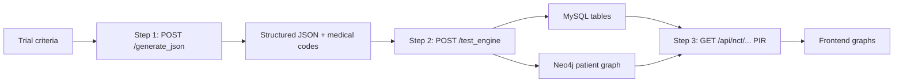
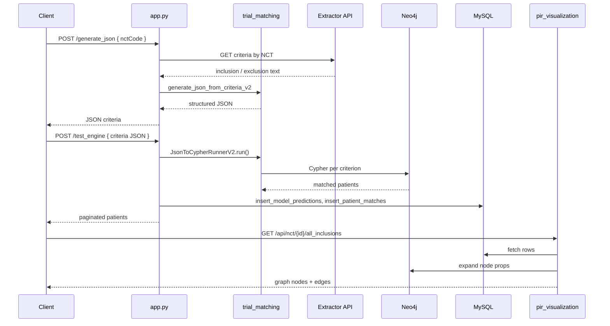

# Graph Trial Match — Code Implementation & End-to-End Workflow

This document explains how the **graph_trial_match** backend works in practice: which code runs at each step, which systems are touched, and how to call the APIs with a concrete example (`NCT05545020`).

Related docs:

- [TRIAL_MATCH_DOCUMENTATION.md](./TRIAL_MATCH_DOCUMENTATION.md) — full API reference
- [README.md](./README.md) — setup and run
- [tests/README.md](./tests/README.md) — manual QA

---

## Big picture



| System | Package / file | Role |
|--------|----------------|------|
| **Extractor API** | `app.py` + `EXTRACTOR_API_URL` | Fetches raw inclusion/exclusion text for an NCT ID |
| **OpenAI** | `trial_matching/json_generator.py` | Classifies and expands criteria to SNOMED, LOINC, RxNorm, etc. |
| **Neo4j** | `trial_matching/cypher_engine_v2.py` | Patient FHIR graph — who matches each rule |
| **MySQL** | `db_writer.py` | Stores match results for lists and PIR APIs |
| **PIR visualization** | `pir_visualization/pir_router.py` | Builds graph JSON for the UI |

**Entry point:** `app.py` (FastAPI on port 8000).

---

## Project structure (what runs where)

```
graph_trial_match/
├── app.py                      # Routes: /generate_json, /test_engine, /generate_and_run
├── trial_matching/
│   ├── json_generator.py       # LLM: criteria text → structured JSON
│   └── cypher_engine_v2.py     # JSON → Cypher → Neo4j patient sets
├── db_writer.py                # INSERT/DELETE MySQL + pagination
└── pir_visualization/
    ├── pir_router.py           # /api/nct/{id}/...
    ├── db_mysql.py             # Read model_prediction_pir
    └── db_neo4j.py             # Expand node properties
```

---

## End-to-end sequence (from documentation)



---

## Example trial: `NCT05545020`

**Eligibility (conceptual):**

- **Include:** adults 18–75, Type 2 diabetes
- **Exclude:** pregnancy

You run the pipeline in order (Postman, frontend, or QA script).

---

## Step 1 — `POST /generate_json` (criteria → structured JSON)

### Purpose

Convert trial inclusion/exclusion into structured JSON with medical codes so the Neo4j engine can query the graph.

### Implementation

| Layer | Code |
|-------|------|
| Route | `app.py` → `generate_json_endpoint()` |
| LLM | `trial_matching/json_generator.py` → `generate_json_from_criteria_v2()` |

### Request example (NCT ID)

```http
POST http://127.0.0.1:8000/generate_json
Content-Type: application/json
```

```json
{
  "nctCode": "NCT05545020"
}
```

### What happens inside

1. **`app.py`** calls `GET {EXTRACTOR_API_URL}?id=NCT05545020` via `httpx`.
2. Parses **`RefinedCriteria`** → `inclusion` and `exclusion` text arrays from the extractor response.
3. **`generate_json_from_criteria_v2()`** runs **two LLM stages per criterion line:**
   - **Stage 1 — Classify:** e.g. “Type 2 diabetes” → `condition`; “Adults 18–75” → `demographics`
   - **Stage 2 — Expand:** SNOMED / LOINC / RxNorm codes, age bounds, operators, time windows
4. Returns JSON the cypher engine understands (`categories`, `codes_by_system`, etc.).

### Alternative inputs (same endpoint)

**Criteria arrays** (no extractor; needs `OPENAI_API_KEY` only):

```json
{
  "nct_id": "NCT05545020",
  "inclusion": [
    "Adults aged 18 to 75 years",
    "Diagnosis of Type 2 diabetes mellitus"
  ],
  "exclusion": ["Pregnant or breastfeeding"]
}
```

**Free text:**

```json
{
  "user_input": "Include adults with Type 2 diabetes. Exclude pregnancy."
}
```

### Response example (simplified)

```json
{
  "nct_id": "NCT05545020",
  "inclusion_criteria": [
    {
      "id": 0,
      "description": "Adults aged 18 to 75 years",
      "logic": "AND",
      "categories": {
        "demographics": {
          "logic": "AND",
          "age_min": 18,
          "age_max": 75
        }
      }
    },
    {
      "id": 1,
      "description": "Type 2 diabetes mellitus",
      "logic": "AND",
      "categories": {
        "condition": {
          "codes_by_system": {
            "http://snomed.info/sct": [
              { "code": "44054006", "display": "Type 2 diabetes mellitus" }
            ]
          }
        }
      }
    }
  ],
  "exclusion_criteria": [
    {
      "id": 0,
      "description": "Pregnancy",
      "categories": {
        "condition": { "codes_by_system": { "...": "..." } }
      }
    }
  ]
}
```

**Save this full response** — it is the body for Step 2.

### PowerShell example

```powershell
curl -X POST http://127.0.0.1:8000/generate_json `
  -H "Content-Type: application/json" `
  -d "{\"nctCode\": \"NCT05545020\"}"
```

---

## Step 2 — `POST /test_engine` (JSON → Neo4j → MySQL)

### Purpose

Run patient matching on Neo4j, score inclusion/exclusion, persist results in MySQL, return paginated patients.

### Implementation

| Layer | Code |
|-------|------|
| Route | `app.py` → `test_engine_endpoint()` |
| Matching | `trial_matching/cypher_engine_v2.py` → `JsonToCypherRunnerV2.run()` |
| Persistence | `db_writer.py` → `insert_model_predictions()`, `insert_patient_matches()`, `fetch_paginated_patients()` |

### Request

Paste the **entire JSON from Step 1** as the request body.

```http
POST http://127.0.0.1:8000/test_engine
Content-Type: application/json
```

```json
{
  "nct_id": "NCT05545020",
  "inclusion_criteria": [ "... from Step 1 ..." ],
  "exclusion_criteria": [ "... from Step 1 ..." ]
}
```

### What happens inside

1. **`_normalize_llm_structure()`** — normalizes codes, logic, `daysBefore`/`daysAfter`, assigns `id` if missing.
2. **Inclusion loop** — for each criterion, `_run_single_criterion()` builds category-specific Cypher:
   - Condition, Observation, Medication, Allergy, demographics
   - Traverse: `Coding → CodeableConcept → Resource → Patient`
3. **Exclusion loop** — only on patients who matched at least one inclusion.
4. **Scoring** — e.g. 2/2 inclusion hits → 100% bucket; any exclusion hit → `"Excluded"`.
5. **MySQL writes:**

   | Function | Table |
   |----------|--------|
   | `insert_model_predictions()` | `model_prediction_pir` |
   | `insert_patient_matches()` | `patient_match_pir` |

   Old rows for the same `nct_id` are deleted first, then new rows inserted.

### Response example (first run)

```json
{
  "status": "success",
  "mode": "initial_run",
  "nct_id": "NCT05545020",
  "page": 0,
  "final_count": 1234,
  "patients": [
    {
      "patientId": "patient-abc-123",
      "percentage_match": 100,
      "match_details": {
        "givenName": "...",
        "familyName": "...",
        "addressText": "..."
      }
    }
  ]
}
```

### Pagination (MySQL only — no Neo4j re-run)

```http
POST http://127.0.0.1:8000/test_engine?page=1
```

Same criteria JSON body. `mode` will be `"pagination"`.

| Call | Behavior |
|------|----------|
| `POST /test_engine` (no `?page`) | Full Neo4j run + MySQL write + page 0 |
| `POST /test_engine?page=0` | Read from MySQL only |
| `POST /test_engine?page=1` | Next page from MySQL |

### PowerShell example

```powershell
curl -X POST http://127.0.0.1:8000/test_engine `
  -H "Content-Type: application/json" `
  -d "@criteria.json"
```

---

## Step 3 — PIR APIs (MySQL + Neo4j → graphs for UI)

### Purpose

Read stored match results and return graph structures for Patient Inclusion Results (PIR) visualization.

### Implementation

| Route prefix | Module |
|--------------|--------|
| `/api/*` | `pir_visualization/pir_router.py` (mounted in `app.py`) |

**Prerequisite:** Step 2 completed for the same `nct_id` (data in MySQL).

### Endpoints and examples

| API | Purpose |
|-----|---------|
| `GET /api/health` | PIR module health |
| `GET /api/nct/{nct_id}/results` | Patients in the top match-percent bucket |
| `GET /api/nct/{nct_id}/all_inclusions` | Full inclusion graph (`nodes` + `edges`) |
| `GET /api/nct/{nct_id}/all_exclusions` | Full exclusion graph |
| `GET /api/nct/{nct_id}/inclusion/{index}` | Single inclusion criterion cluster |
| `GET /api/nct/{nct_id}/exclusion/{index}` | Single exclusion criterion cluster |
| `POST /api/expand/nodes` | Expand Neo4j properties for concept nodes |

### Example — top results

```http
GET http://127.0.0.1:8000/api/nct/NCT05545020/results
```

```json
{
  "nct_id": "NCT05545020",
  "bucket": "100%",
  "records": [ { "patient_id": "...", "match_percent": 100, ... } ]
}
```

### Example — inclusion graph

```http
GET http://127.0.0.1:8000/api/nct/NCT05545020/all_inclusions
```

```json
{
  "nct_id": "NCT05545020",
  "nodes": [
    {
      "id": "concept_123",
      "type": "label",
      "label": "Type 2 diabetes mellitus",
      "props": { "matched_node_id": "123", "criteria_index": 1 }
    },
    {
      "id": "pat__456",
      "type": "patient",
      "label": "456",
      "props": { ... }
    }
  ],
  "edges": [
    {
      "source": "concept_123",
      "target": "pat__456",
      "type": "match",
      "criteria_index": 1
    }
  ]
}
```

### Example — expand nodes

Use `matched_node_id` and `matched_label` from Step 3 graph responses:

```http
POST http://127.0.0.1:8000/api/expand/nodes
Content-Type: application/json
```

```json
{
  "items": [
    { "id": "node-uuid-from-graph", "label": "Condition" }
  ]
}
```

---

## Shortcut — `POST /generate_and_run`

Chains Step 1 + Step 2 in **one request** (no separate save of criteria JSON).

```http
POST http://127.0.0.1:8000/generate_and_run
Content-Type: application/json
```

```json
{
  "nctCode": "NCT05545020"
}
```

### Response shape

```json
{
  "nct_id": "NCT05545020",
  "included_count": { ... },
  "excluded_count": { ... },
  "final_count": 1234,
  "match_groups": { ... },
  "final_patients": [ ... ]
}
```

### When to use which path

| Flow | Use when |
|------|----------|
| **generate_json → test_engine → PIR** | Full product: paginated list + PIR graphs + MySQL persistence for UI |
| **generate_and_run** | Quick one-shot counts and `final_patients`; Step 3 PIR APIs still need `/test_engine` data for graphs |

---

## Practical checklist (Postman / manual QA)

1. `GET /health` — expect `{ "status": "ok", "neo4j_runner": true }`
2. `POST /generate_json` — copy **full** response to `tests/fixtures/my_criteria.json`
3. `POST /test_engine` — paste that JSON as body
4. `GET /api/nct/NCT05545020/results`
5. `GET /api/nct/NCT05545020/all_inclusions`
6. `GET /api/nct/NCT05545020/all_exclusions`
7. `GET /api/nct/NCT05545020/inclusion/0` and `/exclusion/0`
8. `POST /api/expand/nodes` with IDs from graph response

Collection: [postman/Graph_Trial_Match_API.postman_collection.json](./postman/Graph_Trial_Match_API.postman_collection.json)

---

## Common mistakes

| Mistake | Result |
|---------|--------|
| Hand-written body on `/test_engine` (wrong shape, no `categories`) | 500 or empty matches |
| PIR APIs before `/test_engine` | Empty `records` / `nodes` |
| Different `nct_id` in Step 2 vs Step 3 | PIR reads wrong or empty trial |
| Missing `EXTRACTOR_API_URL` with `nctCode` | `EXTRACTOR_API_URL not configured` |
| Server not restarted after creating `.env` | Env vars not loaded |

---

## Data flow summary

| Step | Input | Output / storage |
|------|--------|------------------|
| 1 | NCT ID or text arrays | `inclusion_criteria`, `exclusion_criteria` (in memory / JSON file) |
| 2 | Step 1 JSON | Neo4j matches → `model_prediction_pir`, `patient_match_pir` + API `patients` |
| 3 | `nct_id` only | Graph `nodes` / `edges` for visualization |

---

## Environment variables (implementation dependencies)

| Variable | Step 1 | Step 2 | Step 3 |
|----------|--------|--------|--------|
| `OPENAI_API_KEY` | Required | — | — |
| `EXTRACTOR_API_URL` | Required for NCT flow | — | — |
| `NEO4J_URI`, `NEO4J_USER`, `NEO4J_PASS` | — | Required | Expand nodes |
| `MYSQL_HOST`, `MYSQL_USER`, `MYSQL_PASS`, `MYSQL_DB` | — | Required | Required |

See `.env.example` for defaults.

---

## Neo4j matching logic (Step 2 detail)

For each criterion, `cypher_engine_v2.py`:

1. Builds category-specific Cypher (condition / lab / medication / allergy / demographics).
2. Traverses FHIR-style relationships to `Patient` nodes.
3. Applies filters: code system, numeric thresholds, time windows (`daysBefore` / `daysAfter`), status, negation.
4. Combines results with criterion-level `logic` (AND/OR).
5. Aggregates **inclusion hits** per patient and applies **exclusion** rules.
6. Assigns **match buckets** (e.g. `50%`, `100%`, `Excluded`).

---

## MySQL schema (Step 2 writes, Step 3 reads)

### `model_prediction_pir`

Per-criterion model output (used by PIR normalization and cluster APIs).

Key fields: `nct_id`, `ie` (I/E), `criteria_index`, `pred_list`, `criteria_text`.

### `patient_match_pir`

Per-patient summary for pagination and results bucket.

Key fields: `nct_id`, `patientId`, `percentage_match`, `match_details`.

---

*Last updated for repo layout: `trial_matching` + `pir_visualization` (formerly `LLMTOJSON` + `CLINICALKG`).*
